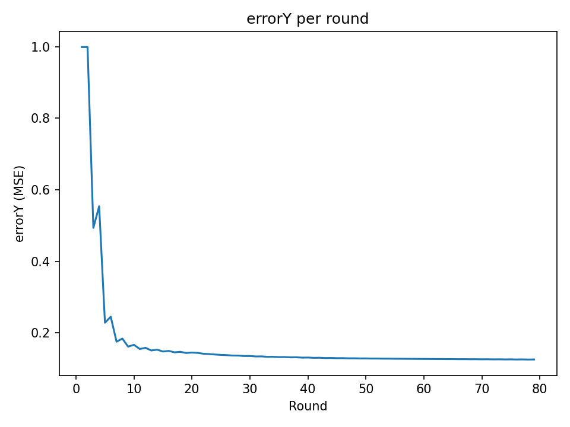
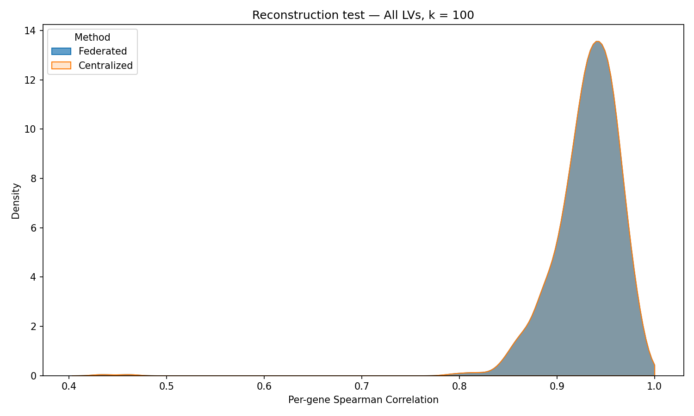

# FPLIER: Federated Pathway-Level Information ExtractoR

Federated version of [PLIER](https://github.com/wgmao/PLIER).

## Code

For more information on Flower, we refer the reader to [Flower's webpage](https://flower.ai/docs/framework/tutorial-series-get-started-with-flower-pytorch.html).

### Environment
Install the python environment by running `conda env create -f flower.yml`. This will ensure the packages versions work correctly.


### Run the federated simulation with the Simulation Engine

In the `.` directory, use `flwr run` to run a local simulation of the federated process:

```bash
flwr run . --stream
```

This will load the data inside `data/client_*` and start the simulated federation. This version uses the complete gene data in `data/server/` and splits it in `options.num-supernodes` parts (the number of clients). At the end of the simulation, 2 images will be created:
- `figures/errorY_curve.png`: the curve of the difference between original Y matrix and reconstructed one.


- `figures/reconstruction_plot.png`: A spearman correlation curve comparing the federated version to the centralized correlation.

